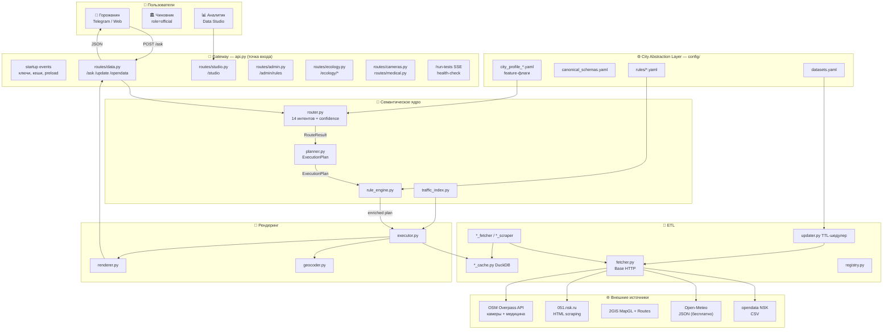

# Полная архитектура NSK OpenData Bot / Сима

## Версия 1.2.0 — март 2026

Система реализует естественно-языковой интерфейс к открытым данным городов. Поток данных однонаправленный: **запрос → классификация → планирование → исполнение → рендеринг → ответ**. Конфигурация города вынесена в горизонтальный слой CAL, который пронизывает все вертикальные слои.

***

## Изменения относительно v1.1.0

Закрыт основной архитектурный долг предыдущей версии:

> ⚠️ v1.1.0: `api.py` = 179 КБ, монолит, требовал разбивки на Gateway + Auth + Events[^1]

**Что сделано в v1.2.0** :

- `api.py` стал **точкой входа** (~250 строк): создаёт `FastAPI app`, подключает middleware, startup events и регистрирует роутеры
- Вся бизнес-логика эндпоинтов перенесена в `src/routes/*.py` (9 роутер-модулей)
- SSE-стриминг тестов (`/run-tests`) остался в `api.py` как системная инфраструктура
- Swagger UI с кастомной навигацией вынесен в отдельный хендлер

***

## Слой 0 — Пользователи

| ID | Роль | Интерфейс |
| :-- | :-- | :-- |
| U1 | Горожанин | Telegram Bot / Web-чат `index.html` |
| U2 | Чиновник / Служащий | Web, параметр `role=official` |
| U3 | Аналитик данных | Data Studio SPA `studio.html` |


***

## Слой 1 — Внешние источники

| ID | Источник | Протокол | Покрытие |
| :-- | :-- | :-- | :-- |
| E1 | opendata.novo-sibirsk.ru | HTTP CSV | НСК |
| E2 | Open-Meteo (замена OpenWeatherMap) | JSON REST, бесплатно | Все города |
| E3 | 2GIS MapGL + Routes API | JS SDK + REST | НСК / Омск |
| E4 | 051.novo-sibirsk.ru (ЖКХ) | HTML scraping | НСК |
| E5 | opendata.omsk.ru | HTTP CSV | Омск |
| E6 | OpenStreetMap Overpass API | REST | Все (OSM ODbL) |
| E7 | CityAir API | JSON REST | НСК (опционально) |

**Изменение:** OpenWeatherMap заменён на Open-Meteo (бесплатный, 11 точек по районам), добавлены E6 (OSM) и E7 (CityAir) .

***

## Слой 2 — City Abstraction Layer (CAL)

**Глоссарий.** CAL — горизонтальный конфигурационный слой, декларативно описывающий город. Это единственный слой, который меняется при тиражировании системы на новый муниципалитет.


| ID | Файл | Содержимое | Связан с |
| :-- | :-- | :-- | :-- |
| C1 | `city_profile_*.yaml` | ID города, центр, bbox, UTC, районы, датасеты, feature-флаги | RF1, ET4 |
| C2 | `canonical_schemas.yaml` | Контракт имён полей — обязательные / опциональные | ET2, Data Studio |
| C3 | `rules/*.yaml` | 4 YAML-регламента: трафик, экология, жизнь, календарь | RE |
| C4 | `datasets.yaml` | Реестр источников данных с URL и TTL | ET4 |

**Новое в v1.2.0:** в C1 добавлены feature-флаги `opendata_csv_enabled`, `power_outages_url`, `has_opendata_csv` — позволяют гибко включать/отключать источники для разных городов без изменения кода .

***

## Слой 3 — Gateway: api.py (FastAPI)

`api.py` — **точка входа**, больше не содержит бизнес-логики. Выполняет: создание app, CORS middleware, startup events, регистрацию роутеров, кастомный Swagger UI, SSE `/run-tests`.

### Зарегистрированные роутеры

| Модуль | Prefix | Тег | Содержание |
| :-- | :-- | :-- | :-- |
| `routes/data.py` | `/` | Запросы / Данные / Управление | Главный Q\&A (`/ask`), `opendata`, `/update` |
| `routes/ecology.py` | `/ecology` | Экология | AQI, PM2.5, PM10, погода, история |
| `routes/transport.py` | `/transport` | Транспорт | Маршруты 2GIS, остановки |
| `routes/cameras.py` | `/cameras` | Камеры | Камеры ПДД (OSM) |
| `routes/medical.py` | `/medical` | Медицина | Медучреждения (OSM) |
| `routes/twogis.py` | `/2gis` | 2GIS | Управление API-ключом 2GIS |
| `routes/ciinsu.py` | `/ciinsu` | ЦИИ НГУ | TF-поиск по базе ЦИИ НГУ |
| `routes/studio.py` | `/studio` | Studio | Data Studio SPA |
| `routes/admin.py` | `/admin` | Управление | Регламенты, пароль, сервисные операции |

### Системные эндпоинты в api.py

| Маршрут | Метод | Назначение |
| :-- | :-- | :-- |
| `/` | GET | Веб-интерфейс (`index.html`) |
| `/docs` | GET | Swagger UI с кастомной навигацией |
| `/run-tests` | GET (SSE) | Стриминг pytest + health-check данных |
| `/static/*` | GET | Статические файлы (tailwind.css, иконки) |

### Startup Events

Четыре события при запуске сервера :

1. `_load_saved_api_keys` — загружает `.env`, затем `data/api_keys.json`
2. `_seed_ecology_history` — заглушки ecology за последние 20 дней
3. `_geocode_metro_stations` — фоновое геокодирование метро через 2GIS (задержка 5 с)
4. `_start_background_preloader` — запуск `preload_all_async` (15 с) + `periodic_refresh_loop`

***

## Слой 4 — Семантическое ядро (CORE)

**Глоссарий.** Confidence-score — числовая оценка уверенности классификатора; при низком значении система запрашивает уточнение или выбирает наиболее вероятный интент по умолчанию.


| ID | Файл | Роль | Вход | Выход |
| :-- | :-- | :-- | :-- | :-- |
| R | `router.py` | Классификатор интентов: 14 тем, confidence-score, стемминг, NER топонимов | текст + топонимы из RF1 | `RouteResult` |
| P | `planner.py` | Построитель плана исполнения | `RouteResult` | `ExecutionPlan` |
| RE | `rule_engine.py` | Движок регламентных правил: пороги критичности, эскалация, сезонность | `ExecutionPlan` + C3 | обогащённый план |
| TI | `traffic_index.py` | Детерминированный расчёт транспортного индекса | данные + погода + календарь | числовой индекс [0–10] |

**Новое в v1.2.0:** router поддерживает 14 тем (добавлены `cameras`, `medical`, `construction`) .

### Поддерживаемые темы и операции роутера

| Тема | Объектов | Тип операции |
| :-- | :-- | :-- |
| `parking` | ~2 360 | COUNT, GROUP, FILTER, TOP_N |
| `stops` | ~746 | COUNT, FILTER |
| `schools` | ~214 | COUNT, GROUP, FILTER |
| `kindergartens` | ~253 | COUNT, GROUP, FILTER |
| `libraries` | ~11 | FILTER |
| `pharmacies` | ~27 | FILTER, TOP_N |
| `sport_grounds` | ~142 | COUNT, FILTER |
| `sport_orgs` | ~89 | FILTER |
| `culture` | ~11 | FILTER |
| `cameras` | ~60 (OSM) | FILTER |
| `medical` | ~100+ (OSM) | COUNT, FILTER |
| `power_outages` | real-time | POWER_STATUS, POWER_TODAY, POWER_PLANNED, POWER_HISTORY |
| `ecology` | real-time | ECO_STATUS, ECO_PDK, ECO_HISTORY |
| `construction` | ~7 877 | CONSTRUCTION_ACTIVE, CONSTRUCTION_COMMISSIONED |


***

## Слой 5 — Справочники города (REF)

| ID | Файл | Данные |
| :-- | :-- | :-- |
| RF1 | `city_config.py` | City Abstraction Object: районы, топонимы, координаты — загружается из C1 |
| RF2 | `metro_data.py` | Станции, линии, переходы метро НСК |
| RF3 | `heat_sources.py` | Котельные и ТЭЦ с координатами |
| RF4 | `airport_data.py` | Аэропорт Толмачёво — терминалы, транспорт |
| RF5 | `emissions.py` | Выбросы загрязняющих веществ (форма 2-ТП Воздух) |
| RF6 | `constants.py` | Типы ресурсов ЖКХ, шкалы критичности, глобальные словари |


***

## Слой 6 — ETL: Адаптеры и Кеши

| ID | Файл | Тип | Назначение |
| :-- | :-- | :-- | :-- |
| ET1 | `fetcher.py` | Base | Универсальный HTTP-клиент: retry, timeout, headers |
| ET2 | `*_fetcher.py` / `*_scraper.py` | Adapters | Предметные адаптеры: экология, ЖКХ (НСК+Омск), камеры, медицина, стройки, транспорт |
| ET3 | `*_cache.py` | Cache | DuckDB-кеши по доменам: ecology, power, construction, cameras, medical |
| ET4 | `updater.py` | Scheduler | TTL-шедулер фонового обновления; читает C4; запускает `preload_all_async` + `periodic_refresh_loop` |
| ET5 | `parser.py` | Transform | CSV-нормализатор: кодировка, разделитель, canonical schema |
| ET6 | `registry.py` | Registry | Реестр тем: загружает `datasets.yaml`, отдаёт метаданные для health-check |


***

## Слой 7 — Хранилище (STORE)

| ID | Тип | Содержимое |
| :-- | :-- | :-- |
| DB | DuckDB in-process | Аналитические запросы по всем доменным таблицам |
| FS | `data/*.json / *.csv` | Файловая система: метаданные кешей, api_keys.json, сырые данные |


***

## Слой 8 — Рендеринг и исполнение (RENDER)

| ID | Файл | Роль |
| :-- | :-- | :-- |
| EX | `executor.py` | Оркестратор вызовов: исполняет `ExecutionPlan`, вызывает кеши, гео, рендер |
| RN | `renderer.py` | HTML-карточки, JSON для карты, ролевые шаблоны |
| CI | `ciinsu.py` | TF-поиск по базе ЦИИ НГУ |
| GEO | `geocoder.py` | Геокодирование адресов через 2GIS API |


***

## Слой 9 — Фронтенд (static/)

| ID | Файл | Содержимое |
| :-- | :-- | :-- |
| F1 | `index.html` | Карта 2GIS MapGL + чат-интерфейс |
| F2 | `studio.html` | Data Studio SPA — просмотр данных по районам |
| F3 | `news-editor.html` | Редактор городских новостей |


***

## Диаграмма потока (Mermaid)




***

## Текущий технический долг (v1.2.0)

| \# | Проблема | Приоритет | Предлагаемое решение |
| :-- | :-- | :-- | :-- |
| TD-01 | `routes/data.py` = 40 КБ — самый крупный роутер | Средний | Вынести обработчики `construction`, `cameras` в отдельные модули |
| TD-02 | `routes/ecology.py` = 25 КБ — содержит логику агрегации | Средний | Выделить `ecology_service.py` с чистой бизнес-логикой |
| TD-03 | `routes/studio.py` = 31 КБ — смешаны SPA и API | Низкий | Разделить `studio_pages.py` (HTML) и `studio_api.py` (JSON endpoints) |
| TD-04 | Нет Auth-слоя (CORS `allow_origins=["*"]`) | Высокий | Добавить `routes/auth.py`: JWT или API-key middleware |
| TD-05 | Нет Data Workshop UI для ручного управления источниками | Средний | Добавить `routes/workshop.py` + `static/workshop.html` (Streamlit или SPA) |
| TD-06 | `_load_dotenv()` — ручная реализация | Низкий | Заменить на `python-dotenv` |


***

## Реестр файлов src/ (актуальный)

```
src/
├── api.py                  # Точка входа FastAPI (GW)
├── routes/                 # Роутеры (GW слой)
│   ├── data.py             # /ask, /update, opendata — 40 KB
│   ├── ecology.py          # /ecology/* — 25 KB
│   ├── studio.py           # /studio — 31 KB
│   ├── transport.py        # /transport/* — 9 KB
│   ├── cameras.py          # /cameras/* — 4 KB
│   ├── medical.py          # /medical/* — 4 KB
│   ├── twogis.py           # /2gis/* — 7 KB
│   ├── ciinsu.py           # /ciinsu/* — 5 KB
│   └── admin.py            # /admin/* — 11 KB
├── router.py               # CORE: классификатор 14 интентов
├── planner.py              # CORE: ExecutionPlan
├── rule_engine.py          # CORE: регламентные правила
├── traffic_index.py        # CORE: индекс пробок
├── executor.py             # RENDER: оркестратор
├── renderer.py             # RENDER: форматирование
├── geocoder.py             # RENDER: геокодирование
├── city_config.py          # REF: City Abstraction Object
├── metro_data.py           # REF: метро НСК
├── heat_sources.py         # REF: ТЭЦ
├── airport_data.py         # REF: аэропорт
├── emissions.py            # REF: выбросы 2-ТП
├── constants.py            # REF: словари
├── fetcher.py              # ETL: Base HTTP
├── updater.py              # ETL: TTL-шедулер
├── registry.py             # ETL: реестр тем
├── parser.py               # ETL: CSV-нормализатор
├── *_fetcher.py            # ETL: предметные адаптеры
├── *_cache.py              # ETL: DuckDB-кеши
├── ciinsu.py               # RENDER: TF-поиск ЦИИ НГУ
└── static/                 # FRONT: index.html, studio.html, news-editor.html
```


